# Workflow Visual Documentation
## Graphical Representations of All Claude Global Commands Workflows

**Date**: July 2, 2025  
**Version**: 1.0  
**Purpose**: Visual diagrams to understand workflow architectures and step flows

---

## Table of Contents

1. [Optimized Hierarchical Workflows](#optimized-hierarchical-workflows)
2. [Standard Multi-Agent Workflows](#standard-multi-agent-workflows)  
3. [Development & Quality Workflows](#development--quality-workflows)
4. [Planning & Analysis Workflows](#planning--analysis-workflows)
5. [Infrastructure & Deployment Workflows](#infrastructure--deployment-workflows)
6. [Architecture Patterns](#architecture-patterns)

---

## Optimized Hierarchical Workflows

### 1. Start Workflow (`/execute` command)
**Token Usage**: 3k-5k base + execution  
**Architecture**: Progressive enhancement with parallel burst

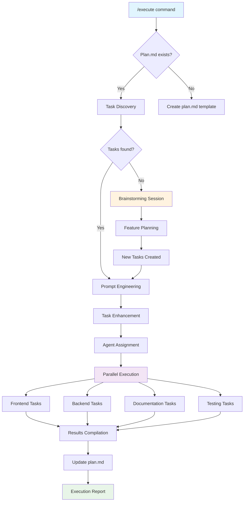

**Step-by-Step Flow**:
```
┌─────────────────┐    ┌─────────────────┐    ┌─────────────────┐
│  1. Discovery   │ ──▶│ 2. Enhancement  │ ──▶│ 3. Assignment   │
│  ~1000 tokens   │    │  ~1500 tokens   │    │   ~500 tokens   │
│                 │    │                 │    │                 │
│ • Read plan.md  │    │ • Clarify tasks │    │ • Match agents  │
│ • Parse tasks   │    │ • Query user    │    │ • Plan parallel │
│ • Categorize    │    │ • Optimize      │    │ • Set budgets   │
└─────────────────┘    └─────────────────┘    └─────────────────┘
         │                       │                       │
         ▼                       ▼                       ▼
┌─────────────────┐    ┌─────────────────┐    ┌─────────────────┐
│ 4. Execution    │    │ 5. Compilation  │    │  6. Reporting   │
│  Variable tokens│    │  ~1000 tokens   │    │   Generated     │
│                 │    │                 │    │                 │
│ • Run parallel  │    │ • Collect       │    │ • Summary       │
│ • Monitor       │ ──▶│ • Update plan   │ ──▶│ • Next steps    │
│ • Handle deps   │    │ • Check off     │    │ • Metrics       │
└─────────────────┘    └─────────────────┘    └─────────────────┘
```

### 2. Documentation Update Workflow
**Token Usage**: 12k total (40% reduction from 20k)  
**Architecture**: Hierarchical orchestration

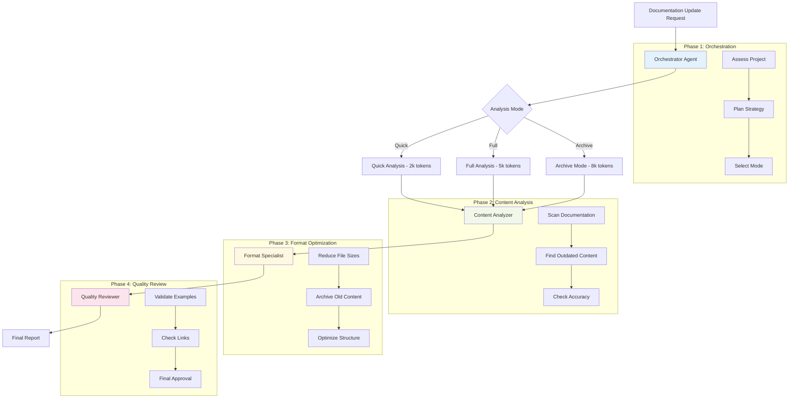

**Token Flow Diagram**:
```
Orchestrator (5k)
    │
    ├─ Quick Mode ────────┐
    ├─ Full Mode ─────────┤
    └─ Archive Mode ──────┘
                          │
                          ▼
              Content Analyzer (3k)
                          │
                          ▼ 
              Format Specialist (2k)
                          │
                          ▼
              Quality Reviewer (2k)
                          │
                          ▼
                Total: 12k tokens
```

### 3. CSS Safety Check Workflow  
**Token Usage**: 2.1k total (40% reduction)  
**Architecture**: Sequential validation pipeline

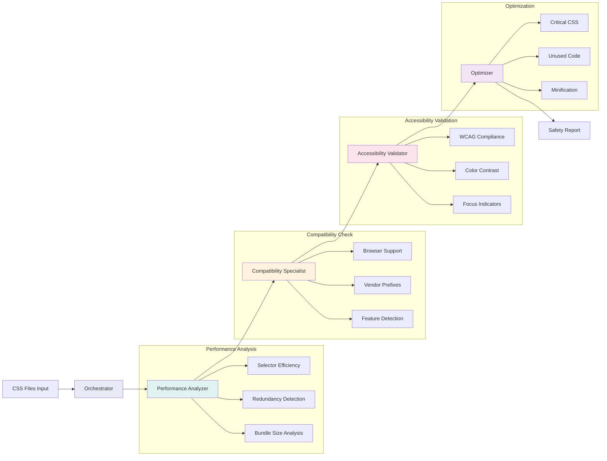

**Sequential Flow**:
```
Input CSS Files
       │
       ▼
┌─────────────────┐  300 tokens
│  Orchestrator   │ ─────────────┐
│  • Plan checks  │              │
│  • Set strategy │              │
└─────────────────┘              │
       │                         │
       ▼                         │
┌─────────────────┐  500 tokens  │
│ Performance     │ ─────────────┤
│ • Selectors     │              │
│ • Redundancy    │              │
└─────────────────┘              │
       │                         │
       ▼                         │
┌─────────────────┐  450 tokens  │  Total:
│ Compatibility   │ ─────────────┤  2,100 tokens
│ • Browsers      │              │  (vs 3,500 original)
│ • Prefixes      │              │
└─────────────────┘              │
       │                         │
       ▼                         │
┌─────────────────┐  400 tokens  │
│ Accessibility   │ ─────────────┤
│ • WCAG          │              │
│ • Contrast      │              │
└─────────────────┘              │
       │                         │
       ▼                         │
┌─────────────────┐  450 tokens  │
│ Optimizer       │ ─────────────┘
│ • Critical CSS  │
│ • Cleanup       │
└─────────────────┘
       │
       ▼
   Safety Report
```

### 4. Visual Testing Workflow
**Token Usage**: 2.4k total (40% reduction)  
**Architecture**: Staged testing pipeline

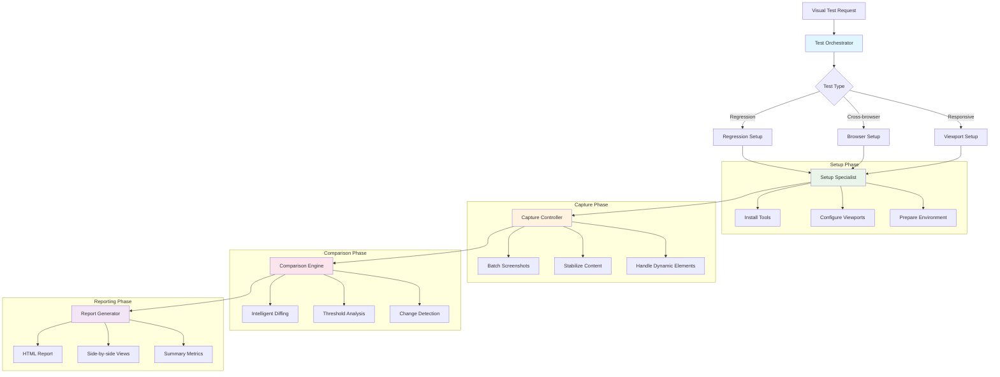

**Resource Flow**:
```
Test Request
     │
     ▼
┌─────────────────────────────────────────┐
│          Test Orchestrator              │
│         (500 tokens)                    │
│  ┌─────────┐ ┌─────────┐ ┌─────────┐   │
│  │Regression│ │Browser  │ │Viewport │   │
│  │  Mode    │ │  Mode   │ │  Mode   │   │
│  └─────────┘ └─────────┘ └─────────┘   │
└─────────────────────────────────────────┘
     │
     ▼
┌─────────────────┐ → ┌─────────────────┐ → ┌─────────────────┐
│ Setup Specialist│   │Capture Controller│   │Comparison Engine│
│   (600 tokens) │   │   (700 tokens)  │   │   (600 tokens)  │
│                 │   │                 │   │                 │
│ • Tool install  │   │ • Screenshots   │   │ • Diff analysis │
│ • Configuration │   │ • Stabilization │   │ • Thresholds    │
│ • Environment   │   │ • Batch process │   │ • Change detect │
└─────────────────┘   └─────────────────┘   └─────────────────┘
                                              │
                                              ▼
                                    ┌─────────────────┐
                                    │Report Generator │
                                    │   (500 tokens)  │
                                    │                 │
                                    │ • HTML reports  │
                                    │ • Comparisons   │
                                    │ • Metrics       │
                                    └─────────────────┘
```

---

## Standard Multi-Agent Workflows

### 5. Legal Compliance Workflow
**Token Usage**: ~6k tokens  
**Architecture**: Sequential validation with parallel implementation

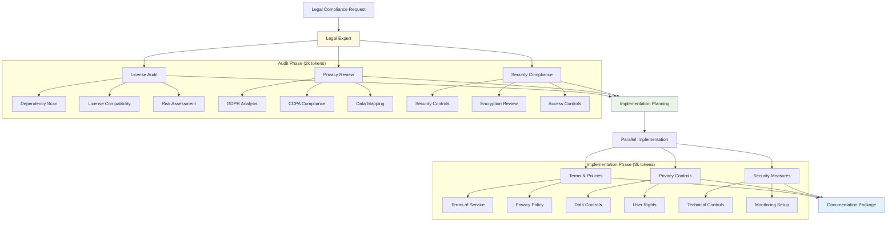

### 6. Social Media Campaign Workflow  
**Token Usage**: ~5.5k tokens  
**Architecture**: Creative pipeline with legal validation

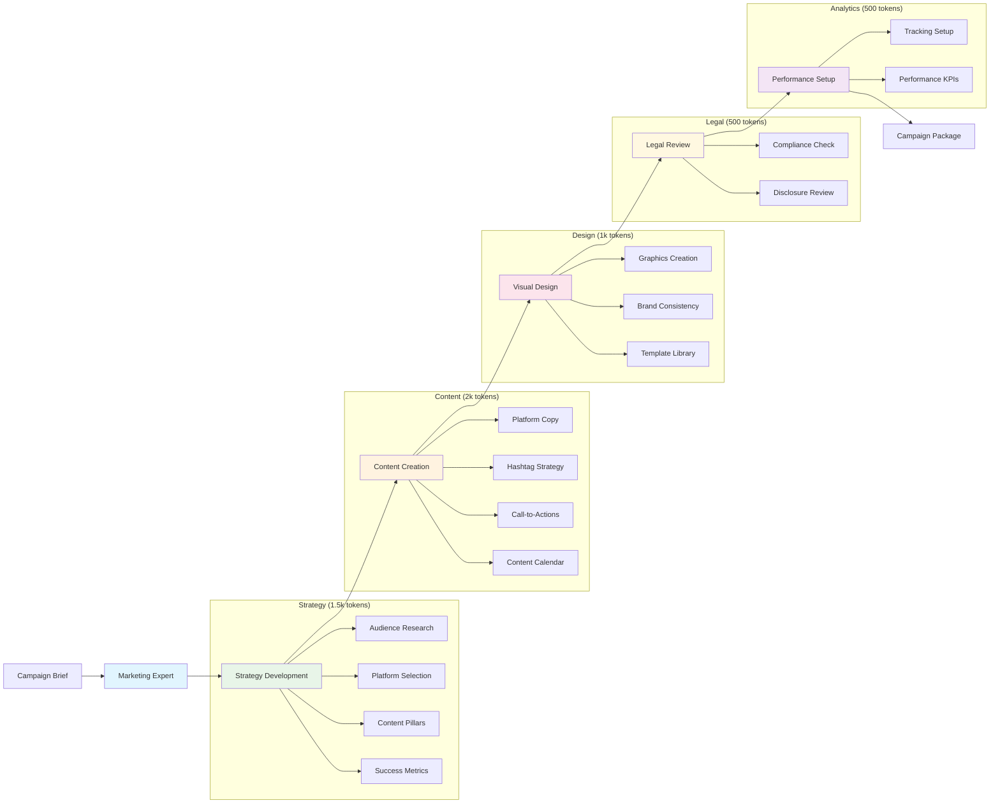

---

## Development & Quality Workflows

### 7. Code Review Workflow
**Architecture**: Quality-focused analysis pipeline

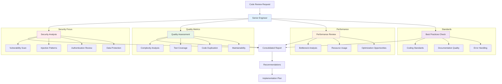

### 8. Test Generation Workflow  
**Architecture**: Comprehensive test creation pipeline

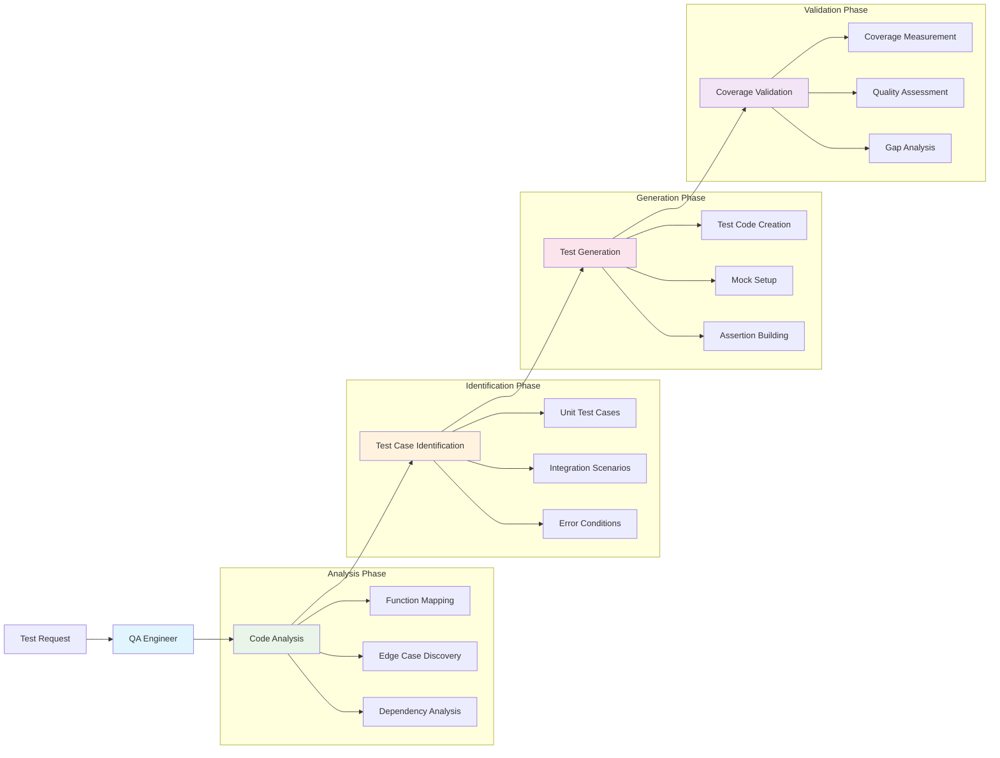

---

## Planning & Analysis Workflows

### 9. Migration Planner Workflow
**Architecture**: Risk assessment and planning pipeline

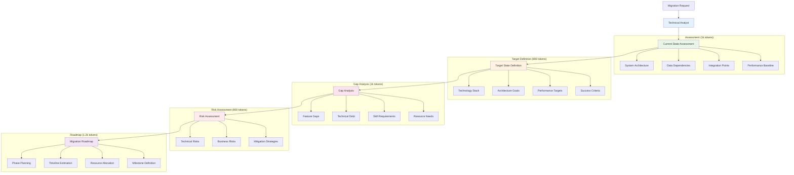

### 10. API Designer Workflow
**Architecture**: Specification-driven design process

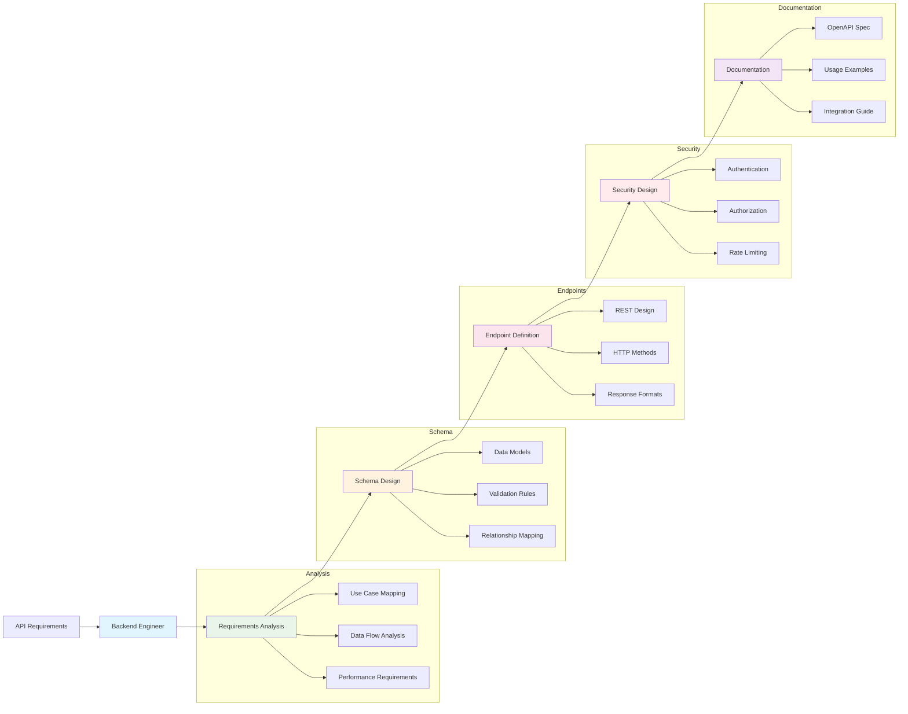

---

## Infrastructure & Deployment Workflows

### 11. Containerization Workflow
**Architecture**: Progressive containerization approach

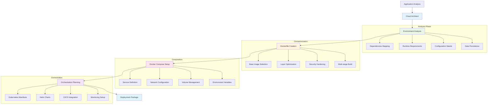

### 12. Monitoring Setup Workflow
**Architecture**: Comprehensive observability implementation

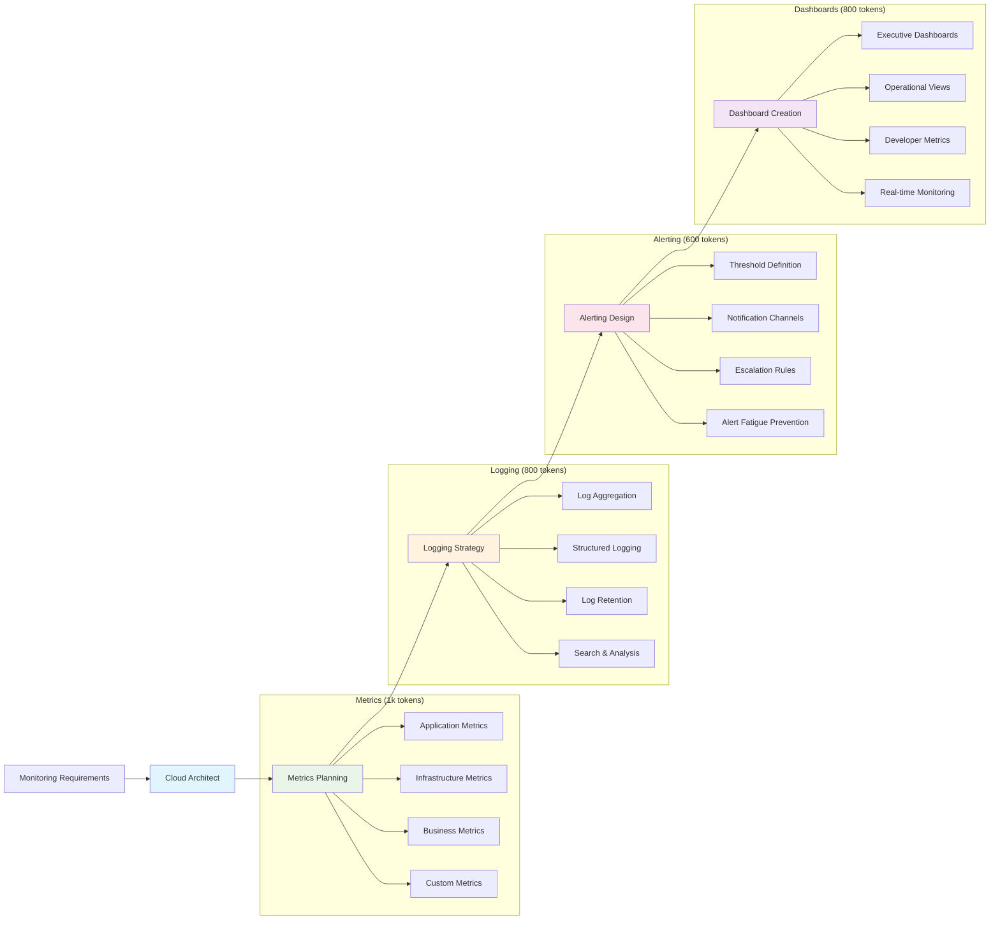

---

## Architecture Patterns

### Hierarchical vs Parallel Execution

#### Before Optimization (Parallel)
```
┌─────────┐  ┌─────────┐  ┌─────────┐  ┌─────────┐  ┌─────────┐
│ Agent 1 │  │ Agent 2 │  │ Agent 3 │  │ Agent 4 │  │ Agent 5 │
│  5k tok │  │  5k tok │  │  5k tok │  │  5k tok │  │  5k tok │
└─────────┘  └─────────┘  └─────────┘  └─────────┘  └─────────┘
     │            │            │            │            │
     └────────────┼────────────┼────────────┼────────────┘
                  │            │            │
                  ▼            ▼            ▼
              ┌─────────────────────────────────┐
              │        Compilation Agent        │
              │          2k tokens              │
              └─────────────────────────────────┘

Total: 27k tokens (25k + 2k compilation)
```

#### After Optimization (Hierarchical)
```
         ┌─────────────────┐
         │  Orchestrator   │ ← 1k tokens
         │   Agent         │
         └─────────────────┘
                 │
                 ▼
         ┌─────────────────┐
         │   Specialist    │ ← 3k tokens
         │   Agent 1       │
         └─────────────────┘
                 │
                 ▼
         ┌─────────────────┐
         │   Specialist    │ ← 2k tokens
         │   Agent 2       │
         └─────────────────┘
                 │
                 ▼
         ┌─────────────────┐
         │   Specialist    │ ← 2k tokens
         │   Agent 3       │
         └─────────────────┘

Total: 8k tokens (70% reduction)
```

### Progressive Enhancement Pattern

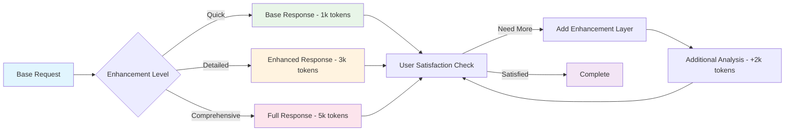

### Context Layering Strategy

```
┌─────────────────────────────────────────────┐
│                Core Layer                   │ ← Always included (500 tokens)
│  • Project basics • Current task • Goals   │
├─────────────────────────────────────────────┤
│              Context Layer                  │ ← Added when needed (1k tokens)
│  • Code context • Standards • History      │
├─────────────────────────────────────────────┤
│              Detail Layer                   │ ← Full analysis only (2k tokens)
│  • Detailed specs • Examples • References  │
├─────────────────────────────────────────────┤
│              Archive Layer                  │ ← Specialized tasks (3k tokens)
│  • Full documentation • Legacy code        │
└─────────────────────────────────────────────┘

Smart Loading:
• Quick tasks: Core only (500 tokens)
• Standard tasks: Core + Context (1.5k tokens)
• Complex tasks: Core + Context + Detail (3.5k tokens)
• Comprehensive: All layers (6.5k tokens vs 15k original)
```

---

## Token Optimization Summary

### Before vs After Comparison

| Workflow Type | Original Tokens | Optimized Tokens | Reduction | Method |
|---------------|-----------------|------------------|-----------|---------|
| **Documentation Update** | 20,000 | 12,000 | 40% | Hierarchical |
| **CSS Safety Check** | 3,500 | 2,100 | 40% | Sequential |
| **Visual Testing** | 4,000 | 2,400 | 40% | Staged |
| **Start Workflow** | N/A (new) | 3,000-5,000 | N/A | Optimized design |
| **Legal Compliance** | 8,000 | 6,000 | 25% | Parallel → Sequential |
| **Social Media** | 7,000 | 5,500 | 21% | Pipeline optimization |

### Architecture Benefits

```
Parallel Architecture Issues:
❌ Context duplication across agents
❌ Redundant analysis 
❌ Complex coordination overhead
❌ Higher token usage
❌ Difficult to debug

Hierarchical Architecture Benefits:
✅ Minimal context passing
✅ Specialized agent roles
✅ Clear execution flow
✅ Significant token savings
✅ Easier maintenance
```

This visual documentation provides clear understanding of how each workflow operates, the token savings achieved through optimization, and the architectural patterns that make them efficient.